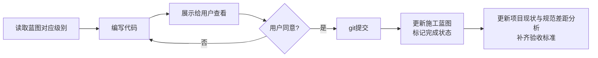

# 按蓝图实现功能（implement-by-blueprint）

按 `docs/重构与新增施工蓝图.md` 中的优先级级别逐步实现功能，每个级别完成后更新蓝图状态和 `.claude/rules/` 下的差距分析文档。

## 工作流



## 流程详细说明

### 1. 确定当前级别

打开 `docs/重构与新增施工蓝图.md`，查看各级别完成状态：

| 级别 | 状态 |
|---|---|
| **P0** 设计规范落地 + 主流程修正 | ✅ 已完成 |
| **P1** 五大功能模块业务填充 | ✅ 已完成 |
| **P1.5** 数据存储迁移 JSON → RelationalStore | ✅ 已完成 |
| **P2** 增强（悬浮窗、图标等） | ❌ 待实现 |

如果用户指定了具体编号（如 "实现 6.1"），直接定位到对应章节。
如果用户说 "下一个级别"，按 P0 → P1 → P1.5 → P2 顺序推进，P2 内部按 6.1 → 6.2 → 6.3 顺序执行。

> **注意**：蓝图中有两种组织方式——优先级级别（P0-P2）和执行里程碑（M0-M6）。用户说"下一个级别"指 P 级别，说"下一个里程碑"指 M 级别。

### 2. 编写代码

**前置检查**：

- 阅读 `CLAUDE.md` 中的 ArkTS 编译约束（`arkts-no-obj-literals-as-types`、ForEach 必须 3 参数、build() 内禁止 const 声明等）
- 阅读 `.claude/rules/项目现状与规范差距分析.md` 了解当前差距
- 对照蓝图的「新建文件」和「改造文件」清单逐个实现
- 如果涉及新增页面，确保注册到 `main_pages.json`

**编码规范**：

- 样式常量优先用 `color.json` / `float.json` 中的 `$r('app.color.xxx')` / `$r('app.float.xxx')`，不用硬编码 hex
- 主色 `#1677FF` / 暖橙 `#FF7D00` / 背景 `#F5F7FA` / 文字主色 `#1D2129` / 文字辅色 `#86909C`
- 代码注释用中文，关键业务逻辑必须写注释
- 不破坏启动（StartAbility）→ 登录/注册 → 首页（MainAbility/Index）主流程

**编译失败处理**：

- 每次修改后自行调用 `hvigorw assembleHap --no-daemon`（或 DevEco Studio 同步）检查编译
- 若连续 **3 次编译失败**（无论什么原因），**立即停下来**，向用户说明失败原因和当前进展，询问是否继续
- 失败计数器每次修改后重置：修改一个文件算一次修改，batch 修改后统一 build 算一次尝试
- 3 次的含义是 3 次 build 失败，不是 3 个错误

### 3. 展示给用户查看

用以下固定格式汇报：

```markdown
## ✅ [级别名称] — 完成

### 新增文件（N 个）
| 文件 | 用途 |
|---|---|

### 改造文件（N 个）
| 文件 | 改动要点 |
|---|---|

### ⏭️ 验证
请编译运行确认无异常，同意后提交。
```

### 4. 用户确认后

#### 4a. git 提交

```bash
git add -A
git commit -m "类型(级别): 变更摘要"
```

commit message 格式：

| 类型 | 场景 |
|---|---|
| `feat(P0)` / `feat(P1)` | 新功能 |
| `fix` | 修复 |
| `style` | 样式调整 |
| `docs` | 文档更新 |
| `refactor` | 重构 |
| `chore` | 构建/配置 |

正文列出每个文件的改动要点。

#### 4b. 更新施工蓝图

在 `docs/重构与新增施工蓝图.md` 中：

1. 将对应级别的标题标记为：
   ```
   ## N、级别名称（✅ YYYY-MM-DD 已完成）
   ```
2. 在该级别末尾添加验收结果：
   ```
   **验收结果 (YYYY-MM-DD)**:
   1. ✅ 条目1
   2. ✅ 条目2
   ```

#### 4c. 更新差距分析

打开 `.claude/rules/项目现状与规范差距分析.md`：

- 将对应章节状态标记从 `❌` 改为 `✅`
- 补充「当前状态」说明列
- 如果引入了新方案决策，在对应章节说明理由

#### 4d. 更新开发规范（如有必要）

如果本次实现引入了新的技术方案或改变了数据架构：

- 更新 `.claude/rules/校园助手APP-开发规范与功能清单.md` 中对应的章节
- 在「确认要点」末尾新增条目记录决策

## 验收标准检查清单

每个级别提交前逐项检查：

- [ ] 编译无 ERROR
- [ ] 新建页面已注册到 `main_pages.json`
- [ ] 启动 → 登录 → 首页主流程正常
- [ ] 施工蓝图已标记完成
- [ ] 差距分析已更新
- [ ] 循环引用/未使用导入检查
- [ ] git 已提交

> 可用 `scripts/check-before-commit.sh` 自动验证部分检查项。

## 项目特有模式参考

以下模式是该项目开发中已验证的常见操作，实现类似需求时直接复用：

| 模式 | 参考实现 |
|---|---|
| 页面数据源从 JSON 切换到 RDB DAO | `StudyTab.ets` 的 `loadCourses` 方法 |
| 非 @Entry 组件获取 UIAbilityContext | `@Prop uiContext?: Context` 从 Index.ets 传入 |
| 编辑数据后返回自动刷新 | `onPageShow` → `@Watch('onRefresh')` 信号机制 |
| 首次启动数据初始化 | `DataInitializer.seedIfEmpty()` 在 `Index.aboutToAppear` 调用 |
| 深色模式切换 | `MineTab.ets` 的 `onDarkModeChange` 回调 |
